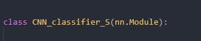
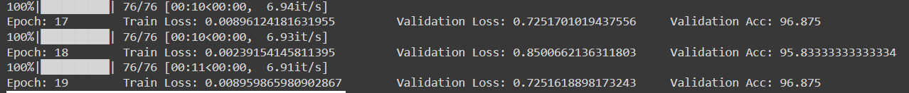

# Pneumonia Detection

## Intro

With a CNN it is possible to be able to use deep learning for an analysis of a chest x-ray is showing pneumonia symptoms or not.

## Install

### Environment
The *requirements.txt* file is provided. If you are using *Conda* or *Virtualenvs* you know the drill `pip install -r requirements.txt` from the main folder.

### Files

1. **data_prep.py**

	Prepares the data. The data is given as a list of images that are available in kaggle under [here](https://www.kaggle.com/paultimothymooney/chest-xray-pneumonia "Link to Kaggle Dataset").

	The dataset has the following appearance.

```
data
 ┣ test
 ┃ ┣ NORMAL
 ┃ ┗ PNEUMONIA
 ┗ train
 ┃ ┣ NORMAL
 ┃ ┗ PNEUMONIA
 ┃ ┗ PNEUMONIA


```
The module will generate the train and test dataloaders and store them into a *dataloader* object.  (yes, I know that to store them as Dataloader just uses more space, but I wanted to check how good Dataloaders can be stored in pickle. I have another project called *Movement detection* where I store the plain name of the files and generate the dataloader object just before the training.)

2. **model.py**

We have defined two CCN models here they one smaller (ends on *_S*) and one bigger (ends with *_M*) Here are defined and will be imported accordingly.  



3. **train.py**

	The model will be trained and two weights will be stored under the folder models. The model is constrained to use a 640x640 image and all the images will be schrinked accordingly.

	Using the small model we got convergence after a few epochs (merely 10 will suffice) and we got the following results.

	

4. **inference.py**

	Here we have the *predict(image_filename)* method that willgive us a prediction of the required image.
